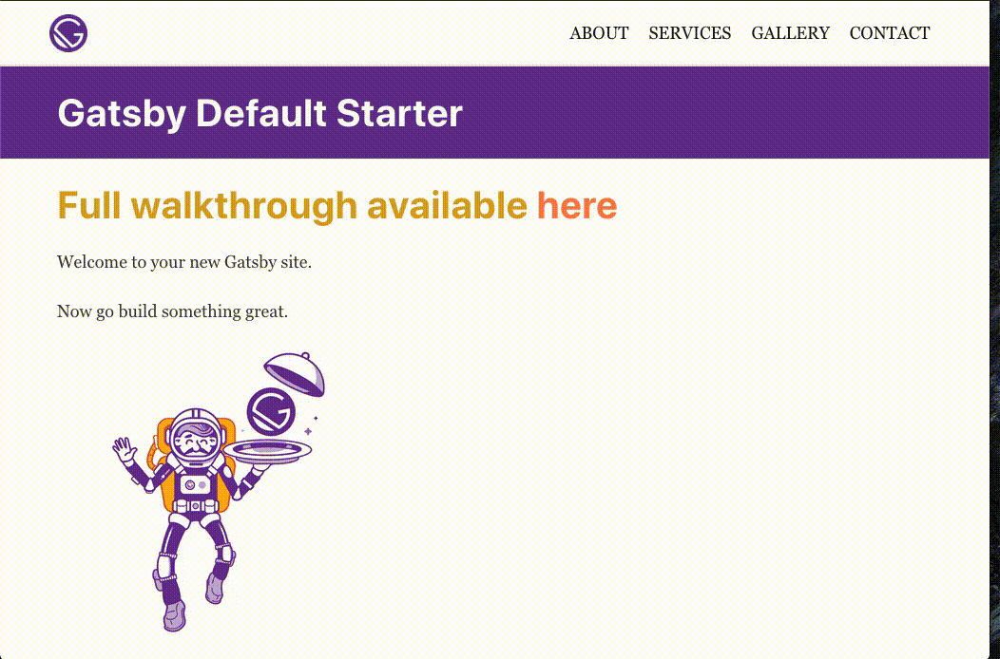
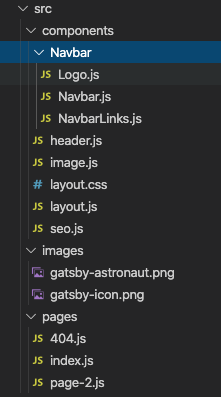

In this walkthrough, I'll guide you through the steps of building a simple navigation bar with [GatsbyJS](https://gatsbyjs.org). We'll use [Styled Components](https://https://www.styled-components.com) to style our application.

  **[Live demo](https://gatsby-navigation.netlify.com/)**

## Motivation
I was trying to find an extremely simple and responsive Gatsby navigation bar that utilizes Styled components and useState hook but ended up creating my own. I'll be happy if there's at least one person that finds this tutorial somewhat useful.


### Requirements
If you've found this tutorial, I assume that you've already got **node** and **gatsby-cli** installed on your machine.

- **node** - check in terminal by typing:
```
node -v
```
-  **gatsby-cli** if not, use your terminal to install:
```
npm install -g gatsby-cli
```


## Installation
Begin with creating a new project, we'll call it **gatsby-navigation** and use a default starter. I intended to change as little as possible inside the starter.

```
gatsby new gatsby-navigation https://github.com/gatsbyjs/gatsby-starter-default
```


It's time to navigate into the new site directory.
```
cd gatsby-navigation
```

### Styled Components
Styled components is a CSS-in-JS framework enables you to write plain CSS utilizing template literals in your components without worrying about name collisions - meaning, it simply generates unique class names for styles. Components can be dynamically styled based on props or a theme. You don't have to worry about vendor prefixes. Furthermore, takes advantage of Critical CSS technique - ships the bare minimum required to render a page.

Instal in terminal:
```
npm install --save gatsby-plugin-styled-components styled-components babel-plugin-styled-components
```
Don't forget to add `'gatsby-plugin-styled-components'` to plugins array in **gatsby-config.js**

## Start Building
Since we've got everything already installed, it's time to start developing our navbar.
```
gatsby develop
```
Let's start by creating a directory named **Navbar** with **Logo.js**, **Navbar.js** and **NavbarLinks.js** inside.



### Logo
Almost every navigation needs a logo so we'll use **GraphQL** with **gatsby-image** to grab our logo from images directory.

**gatsby-image** enables us to optimize images without tons of tedious work.

```js
// Logo.js

import React from "react"
import Img from "gatsby-image"
import { useStaticQuery, graphql } from "gatsby"


const Logo = () => {
  const data = useStaticQuery(graphql`
    query {
      file(name: { eq: "gatsby-icon" }, extension: { eq: "png" }) {
        childImageSharp {
          fluid(maxWidth: 50, pngQuality: 80) {
            ...GatsbyImageSharpFluid
          }
        }
      }
    }
  `)
  return (
      
  )
}

export default Logo

```

### Navbar Links
**Link** is a special component designed to link between internal pages instead of using `<a>` tags. 
What is so special about it? Simply, it prefetches our pages.
```js
// NavbarLinks.js

import React from "react"
import { Link } from "gatsby"

const NavbarLinks = () => {
  return (
    <>
      <Link to="/">About</Link>
      <Link to="/404">Services</Link>
      <Link to="/">Gallery</Link>
      <Link to="/404">Contact</Link>
    </>
  )
}

export default NavbarLinks

```

### Navigation Bar 

The component that holds most of the logic of our navbar. We'll use a **conditional (ternary) operator** to switch between props and a **useState hook** to hold the state of our navigation.

```js
// Navbar.js

import React, { useState } from "react"
import NavbarLinks from "./NavbarLinks"
import Logo from "./Logo"
import styled from 'styled-components'

const Navigation = styled.nav``
const Toggle = styled.div``
const Navbox = styled.div``
const Hamburger = styled.div``


const Navbar = () => {
  const [navbarOpen, setNavbarOpen] = useState(false)

  return (
    <Navigation>
      <Logo />
      <Toggle
        navbarOpen={navbarOpen}
        onClick={() => setNavbarOpen(!navbarOpen)}
      >
        {navbarOpen ? <Hamburger open /> : <Hamburger />}
      </Toggle>
      {navbarOpen ? (
        <Navbox>
          <NavbarLinks />
        </Navbox>
      ) : (
        <Navbox open>
          <NavbarLinks />
        </Navbox>
      )}
    </Navigation>
  )
}

export default Navbar

```


## You've got it! 
Congratulations! By this time our application should look extraordinarily bad, but the guts are already in place...


## Let's add some styling
Aside from making it responsive, it is time to use the good stuff that comes with Styled components. In our case, we'll use props to determine which styles should be active.

#### Final Logo
We've added a wrapper to enclose our image. You'd most likely use it to take us to our homepage so we'll make treat our wrapper as a link.
```js
// Logo.js
import React from "react"
import styled from "styled-components"
import Img from "gatsby-image"
import { Link, useStaticQuery, graphql } from "gatsby"

const LogoWrap = styled.div`
  margin: auto 0;
  flex: 0 1 36px;

  @media (max-width: 768px) and (orientation: landscape) {
    flex: 0 1 25px;
  }
`
const Logo = () => {
  const data = useStaticQuery(graphql`
    query {
      file(name: { eq: "gatsby-icon" }, extension: { eq: "png" }) {
        childImageSharp {
          fluid(maxWidth: 50, pngQuality: 80) {
            ...GatsbyImageSharpFluid
          }
        }
      }
    }
  `)

  return (
    <LogoWrap as={Link} to="/">
      
    </LogoWrap>
  )
}

export default Logo

```

#### Final Navbar Links
Let's make a new component that's based on a **Link** component and style it.
```js
// NavbarLinks.js

import React from "react"
import styled from "styled-components"
import { Link } from "gatsby"

const NavItem = styled(Link)`
  text-decoration: none;
  color: #111;
  display: inline-block;
  white-space: nowrap;
  margin: 0 1vw;
  transition: all 200ms ease-in;
  position: relative;

  :after {
    position: absolute;
    bottom: 0;
    left: 0;
    right: 0;
    width: 0%;
    content: ".";
    color: transparent;
    background: goldenrod;
    height: 1px;
    transition: all 0.4s ease-in;
  }

  :hover {
    color: goldenrod;
    ::after {
      width: 100%;
    }
  }

  @media (max-width: 768px) {
    padding: 20px 0;
    font-size: 1.5rem;
    z-index: 6;
  }
`
const NavbarLinks = () => {
  return (
    <>
      <NavItem to="/">About</NavItem>
      <NavItem to="/404">Services</NavItem>
      <NavItem to="/">Gallery</NavItem>
      <NavItem to="/404">Contact</NavItem>
    </>
  )
}

export default NavbarLinks

```

#### Final Navigation Bar 
Now add styling based on props passed into our Hamburger component using template literals.
```js

// Navbar.js

import React, { useState } from "react"
import styled from "styled-components"
import NavbarLinks from "./NavbarLinks"
import Logo from "./Logo"

const Navigation = styled.nav`
  height: 10vh;
  display: flex;
  background-color: #fff;
  position: relative;
  justify-content: space-between;
  text-transform: uppercase;
  border-bottom: 2px solid #33333320;
  margin: 0 auto;
  padding: 0 5vw;
  z-index: 2;
  align-self: center;

  @media (max-width: 768px) {
    position: sticky;
    height: 8vh;
    top: 0;
    left: 0;
    right: 0;
    left: 0;
  }
`

const Toggle = styled.div`
  display: none;
  height: 100%;
  cursor: pointer;
  padding: 0 10vw;

  @media (max-width: 768px) {
    display: flex;
  }
`

const Navbox = styled.div`
  display: flex;
  height: 100%;
  justify-content: flex-end;
  align-items: center;

  @media (max-width: 768px) {
    flex-direction: column;
    position: fixed;
    width: 100%;
    justify-content: flex-start;
    padding-top: 10vh;
    background-color: #fff;
    transition: all 0.3s ease-in;
    top: 8vh;
    left: ${props => (props.open ? "-100%" : "0")};
  }
`

const Hamburger = styled.div`
  background-color: #111;
  width: 30px;
  height: 3px;
  transition: all .3s linear;
  align-self: center;
  position: relative;
  transform: ${props => (props.open ? "rotate(-45deg)" : "inherit")};

  ::before,
  ::after {
    width: 30px;
    height: 3px;
    background-color: #111;
    content: "";
    position: absolute;
    transition: all 0.3s linear;
  }

  ::before {
    transform: ${props =>
      props.open ? "rotate(-90deg) translate(-10px, 0px)" : "rotate(0deg)"};
    top: -10px;
  }

  ::after {
    opacity: ${props => (props.open ? "0" : "1")};
    transform: ${props => (props.open ? "rotate(90deg) " : "rotate(0deg)")};
    top: 10px;
  }
`
const Navbar = () => {
  const [navbarOpen, setNavbarOpen] = useState(false)

  return (
    <Navigation>
      <Logo />
      <Toggle
        navbarOpen={navbarOpen}
        onClick={() => setNavbarOpen(!navbarOpen)}
      >
        {navbarOpen ? <Hamburger open /> : <Hamburger />}
      </Toggle>
      {navbarOpen ? (
        <Navbox>
          <NavbarLinks />
        </Navbox>
      ) : (
        <Navbox open>
          <NavbarLinks />
        </Navbox>
      )}
    </Navigation>
  )
}

export default Navbar


```
## Wrapping up
Combining styled components with useState hook is a modern way of writing React’s code, it’s quite easy to implement and gives our app a clean look. 

Feel free to share if you found it useful.
### Sandbox 
Here's a convenient way to change some things to suit your style
<iframe
     src="https://codesandbox.io/embed/gatsby-navigation-emn2v?fontsize=14&hidenavigation=1&theme=dark"
     style="width:100%; height:600px; border:0; border-radius: 4px; overflow:hidden;"
     title="gatsby navigation"
     allow="geolocation; microphone; camera; midi; vr; accelerometer; gyroscope; payment; ambient-light-sensor; encrypted-media; usb"
     sandbox="allow-modals allow-forms allow-popups allow-scripts allow-same-origin"
   ></iframe>

## Links 
**[Read on Medium](https://medium.com/@snopkowski/gatsby-navigation-using-styled-components-and-usestate-hook-d000b3439ab0)**

**[Github repo](https://github.com/Snopkowski/gatsby-navigation)**

**[Live demo](https://gatsby-navigation.netlify.com/)**