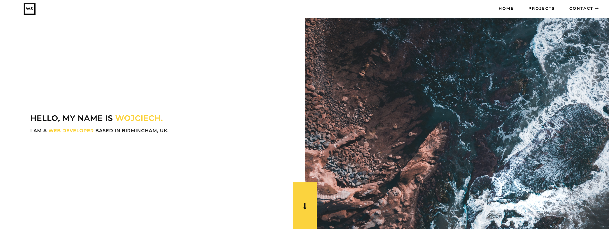

## I needed a new portfolio
It came across my mind that my portfolio was a little outdated in terms of technologies used to build it. 
The previous website utilized just HTML, plain CSS and vanilla JavaScript. Updating and deployment were something I would consider rather tedious.
This time, I didn't feel the urge to use a vast range of blows and whistles. I want it as minimalistic as possible and incredibly performant.


*Screenshot of my old portfolio site*

## What was I looking for?
- **React-based** - love the absence of the loading bar on top of browser's window while switching pages.
- **Performance** - unlike some WordPress gurus, I'd wouldn't be okay with the page audit sitting on 20/100. 
- **Ease of updates** - would rather focus on creating rather than fixing.
- **Search Engine Optimization** - it's a long term game that might turn out to beneficial in the future. 
- **Easy to deploy** - the ability to build itself automatically right after `git push`.

## What options did I also consider?

I've done some research about different tools for the job and came up with something like this:

|                                 | Gatsby |   Create React App   |        Next.js       |
|:-------------------------------:|:------:|:--------------------:|:--------------------:|
|          **Rendering**          | Static | Client-Side Rendered | Server Side Rendered |
| **Simple to set up and deploy** |   Yes  |          Yes         |          No          |
|             **SEO**             |  Good  |          Bad         |         Good         |
|      **Frequent updates***      |   No   |          Yes         |          Yes         |

frequent updates* - constantly updating values - like once every second.

Unlike next.js, a Gatsby site can be hosted on [netlify](https://www.netlify.com) free of charge.


## Why did I choose Gatsby?

There are a couple of reasons standing behind my choice:
- Gatsby is a Site Generator that combines JavaScript, APIs and Markup, aka JAM Stack.
- It shines in terms of SEO - users like fast websites, Google does too.
- Rich plugin directory - there's no point in reinventing the wheel.
- Utilizes GraphQL to build it's data layer and therefore - fetching data from multiple sources works like a charm.
- Can be hosted on netlify or similar platforms.


## How did it go?

In the past, I've done a couple of small projects using React, so I was already somewhat familiar with relevant practices.

### Sourcing data from Contentful
Like my wife rushing to Starbucks to get her pumpkin spice latte as soon as it's back on the menu, I rushed into sourcing content using a headless CMS. I went with a popular choice - Contentful. It was like that latte - it's coffee after all, but I felt something was missing in it. That something, in this case, was **image optimization**. 

To do this I set up my content model, installed **`gatsby-source-contentful`**. The idea backing it up seemed great - easy to implement. I also managed to set up the deployment trigger on content changes.

#### Rich text and optimizing images
To add blog posts that have a different structure from one another, I used a **`gatsby-transformer-contentful-richtext`**. Optimizing images using **`gatsby-remark-images`** has become impossible due to the fact the GraphQL query should look like this example below:
```
{
  allContentfulBlogPost {
    bodyRichText {
      childContentfulRichText {
        html
      }
    }
  }
}
```
[More details regarding image optimization using contentful](https://github.com/gatsbyjs/gatsby/issues/14338).

#### ENV variables and gatsby-source-contentful
For some reason unclear to myself back then, I wasn't able to set up **environment variables** properly on my local machine. Netlify had it covered hassle-free. Finally, I stumbled upon [this blog post by Kyle Shevlin](https://kyleshevlin.com/firebase-and-gatsby-together-at-last) providing a solid explanation to my problem.

#### Final thoughts on contentful
The issues described above helped me to make my mind about it. I would try another headless CMS provider if that was a blog for my wife so she could add content from mobile and make it completely non-developer proof. 

### Sourcing data from Markdown files

I wanted to get a better grasp of what markdown language is, how to use it effectively and get good at it. Found a really useful [cheat sheet by Adam Pritchard](https://github.com/adam-p/markdown-here/wiki/Markdown-Cheatsheet#code) to get familiar with creating markdown files. 

## Summary
I got to admit that I enjoyed the development process using Gatsby. I'm glad that I made this choice for a project like a portfolio website - I would choose it again.
By all means, I don't consider myself a highly proficient using it, but I have to note that Gatsby has incredible [documentation](https://www.gatsbyjs.org/docs/) and [tutorials](https://www.gatsbyjs.org/tutorial/) to get you up and running fairly quickly. I'm looking forward to building more project using it.

